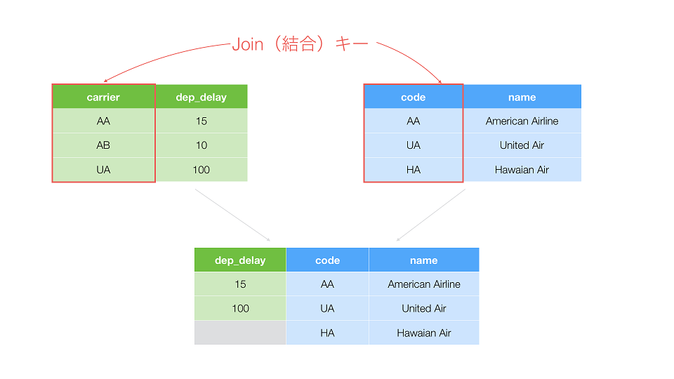

# 結合の種類

* 一般的なテーブル結合の種類まとめ

---

## 1. 左外部結合（Left Join）
* エクセルの **VLOOKUP** と原則的に同じ

## 2. 右外部結合（Right Join）

## 3. 完全外部結合（Full Join）
* 左外部結合と右外部結合の両方を兼ね備えた結合方法

## 4. 内部結合（Inner Join）
* 全外部結合と逆
* マッチするキーがある行のみを保持

## 5. セミ結合（Semi Join）
* 結合先のテーブルに一致する値を持つ行のみを保持

## 6. アンチ結合（Anti Join）
* セミ結合と逆
* 結合先に一致する値がない行のみを保持

