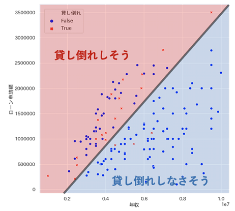
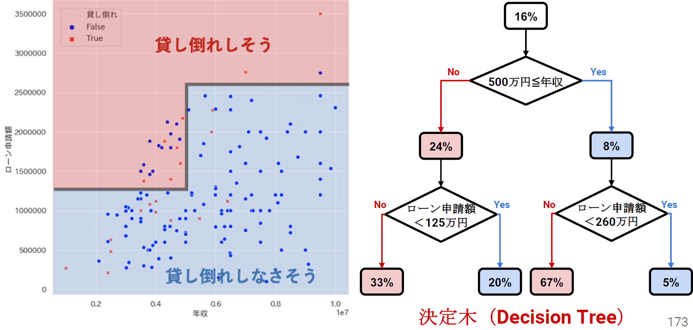

# 機械学習概論

## 機械学習の概念
入力xと出力yの関係性を見つけること

## 機械学習で使う数学
1. 微分、線形代数
2. 積分、確立、統計

## 人工知能（AI）、機械学習、ディープラーニングの違い
#### 人工知能
* 人間の知能を模した知的な処理能力を持つ機械
  * 推論、認識、判断などの意思決定ができる
  * テキスト処理、画像認識などの作業ができる
  * 人工知能とロボットの違い
    ||人工知能|ロボット|
    |--|:--:|:--:|
    |物理的構造|ない|ある|
    |学習能力|ある|ない|

#### 機械学習
* 人工知能に含まれる考え方
* 試行を繰り返すことで機械があるタスクを改善できるようにする仕組み
* 機械学習の手法は人工知能に属するということができるが、人工知能の手法の全てが機械学習に属するとは言えない
* 人工知能の一部には、あるルールに基づいて学習を行うという機械学習の考え方を逸脱している部分がある

#### ディープラーニング
* 機械学習の手法
* 画像やテキストといった非常に大きいデータを使いニューラルネットワークのモデルを活用する

#### ニューラルネットワーク
* 人間の脳に着想を得たモデル

## ディープラーニングと機械学習の違い
* 機械学習
  * 学習をさせるためのモデルを選択
  * 人の手によって特徴を抽出

* ディープラーニング
  * ネットワークの型を決める
  * 演算が行われた結果、自動的に特徴が抽出される

## 機械学習の３大トピック
#### 教師あり問題
入力xと出力yが存在し、数値から予測値を出す。  
広さから家賃を出すなど最もビジネス向き。

* 分類問題
    * 正／負、True／False、Yes／No 等の二値分類問題
    * 複数の種類を当てる多値分類問題
* 連続値問題（回帰問題）
    * 連続的な数値を当てる問題
    * ラベル付け、ランク付け、レコメンデーション
* 学習データで何が正解化を示す必要がある

#### 教師なし問題
入力xのみでデータの属性や特性を理解したい場合に用いる。

* 異常検知問題
    * 今までに見たことのないような状態を見つける異常検知問題
* クラスタリング問題
    * 観測データを類似度の観点から少数のグループに分ける問題

#### 強化学習
データがない、もしくは殆どない場合に用いる。  
掃除機ロボットのように動きながらデータを取得して学習するケース。

## 問題のマッピング
|問題タイプ|非時系列ビジネス課題|時系列ビジネス課題|
|--|--|--|
|二値分類|購入しそうな顧客、解約予測|ー|
|多値分類|病気の診断、画像分類|相転移予測、状態予測|
|連続値問題|年収予測、損害額推定|需要予測、来店社予測|
|異常値|不正検知、不良品判定|故障検知、健康異常検知|
|クラスタリング|マーケットセグメンテーション、類似文書探索|ー|

## アルゴリズムの種類
#### 回帰型アルゴリズム
* 入力データから __y = ax + b__ のような一次関数で表せるモデルを作成する
* ２種類の入力データをまっすぐに切り分けるような境界面（決定境界）を見つける

#### 木型アルゴリズム
* 与えられた特徴量に対して条件を複数の条件分岐によって分割する
* 分割されたデータのグループに同一のラベルが多く存在するような組み合わせを探す
* 回帰型アルゴリズムより複雑な境界面を定義できる

