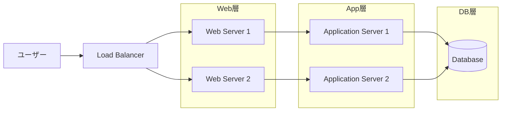
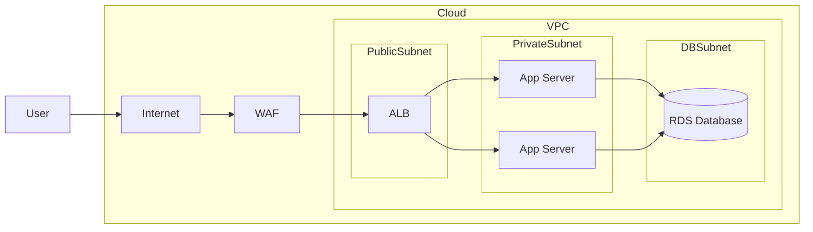
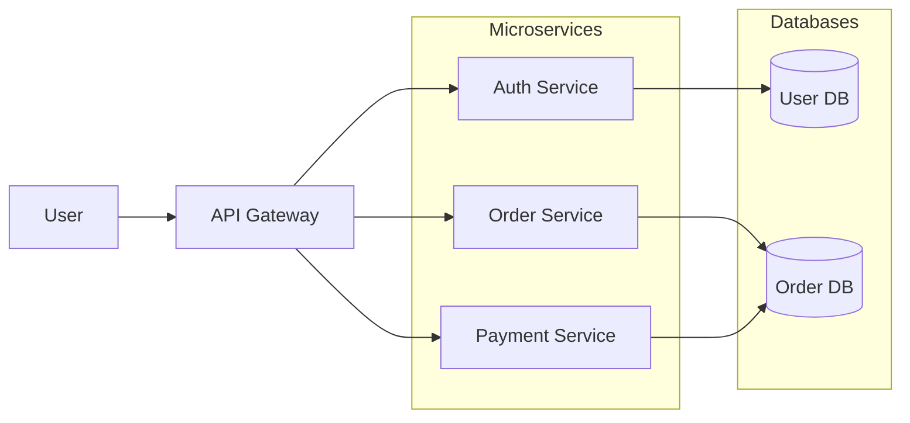
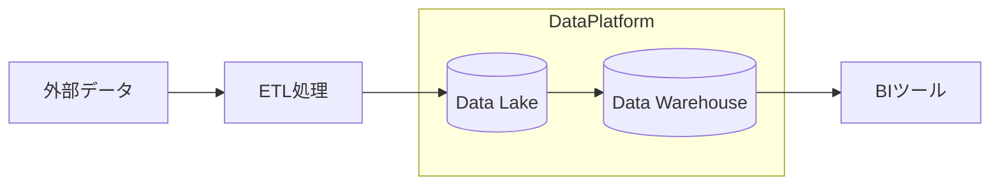
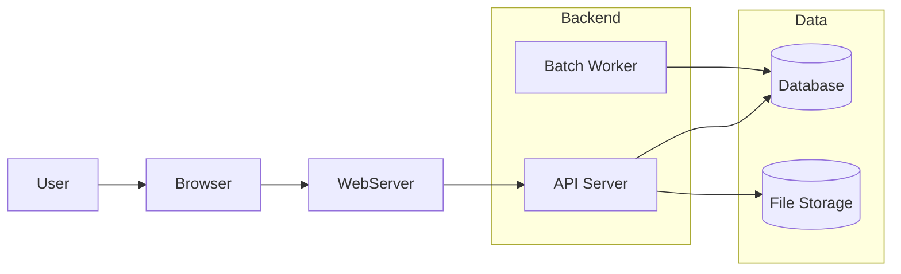
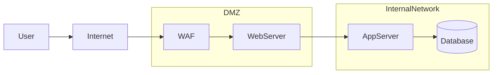

# システム構成図

---

## 基本システム構成テンプレ（3層アーキテクチャ）

* 典型的な Web / App / DB の3層構造



---

## クラウド構成テンプレ（AWS系）

* WAF, VPC, ,Subnet, RDS などをサブグラフで表現




---

## マイクロサービス構成テンプレ

特徴
* API Gateway
* サービス分離
* DB分離




---

## データパイプライン（ETL）

用途
* データ分析
* データ基盤
* AI学習基盤



---

# 5 社内業務システム構成（実務でよくある）



---

# 6 セキュリティ境界付き構成

セキュリティ資料ではこれがよく使われます。



---

# Mermaid システム図のコツ

実務では以下を意識すると読みやすくなります。

### 1 レイヤー分離

```
User
↓
Edge
↓
Web
↓
App
↓
Data
```

---

### 2 サブグラフを多用

```
subgraph VPC
subgraph Backend
subgraph Database
```

---

### 3 DBは丸

```
DB[(Database)]
```

---

### 4 外部システムは枠で囲う

```
subgraph External
```
