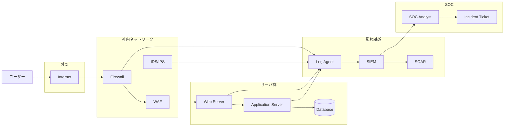
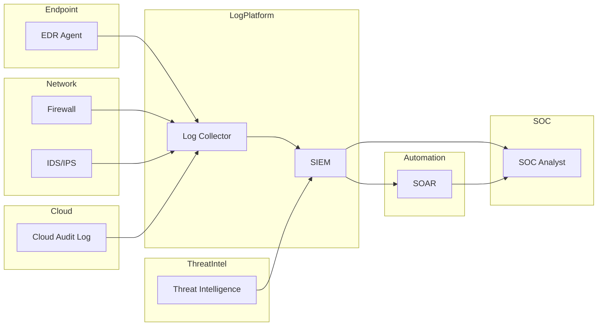
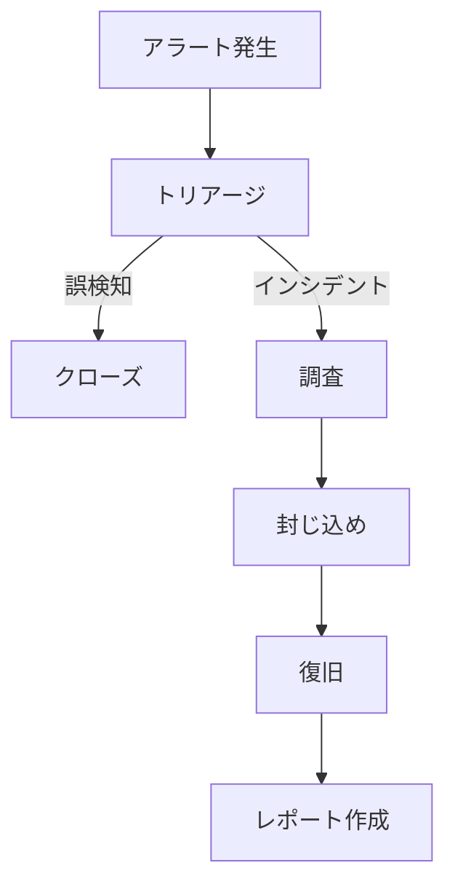

# セキュリティ監視構成図

---

## SOCセキュリティ監視構成

---

## SOC構成の役割

| 層       | 役割                 |
| -------- | -------------------- |
| ログ収集 | 各機器からログを収集 |
| 分析     | SIEMで相関分析       |
| 自動対応 | SOARで自動化         |
| 運用     | SOCアナリストが対応  |

---

## SOCログ収集対象

SOCでは以下のログが必須

### ネットワーク機器

* Firewall
* IDS / IPS
* WAF
* VPN

### サーバ

* Web Server
* Application Server
* Database

### エンドポイント

* EDR
* Windows Event Log
* Linux Syslog

### クラウド

* AWS CloudTrail
* Azure Monitor
* GCP AuditLog

---

## 実務SOC構成

最近は **EDR + SIEM + SOAR + Threat Intelligence** が主流

---

## インシデント対応フロー

