# フローチャート

---

## 基本構文

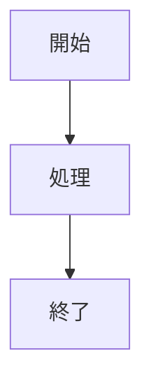

- `TD` = Top Down（上→下）
- `LR` = Left Right（左→右）

---

## ノード形状

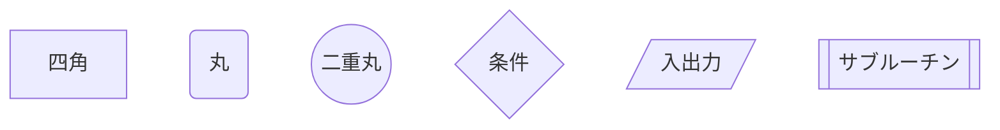

| 記法    | 意味         |
| ------- | ------------ |
| `[ ]`   | 処理         |
| `( )`   | 開始・終了   |
| `(( ))` | 強調         |
| `{ }`   | 条件分岐     |
| `[/ /]` | 入力出力     |
| `[[ ]]` | サブルーチン |

---

## 条件分岐

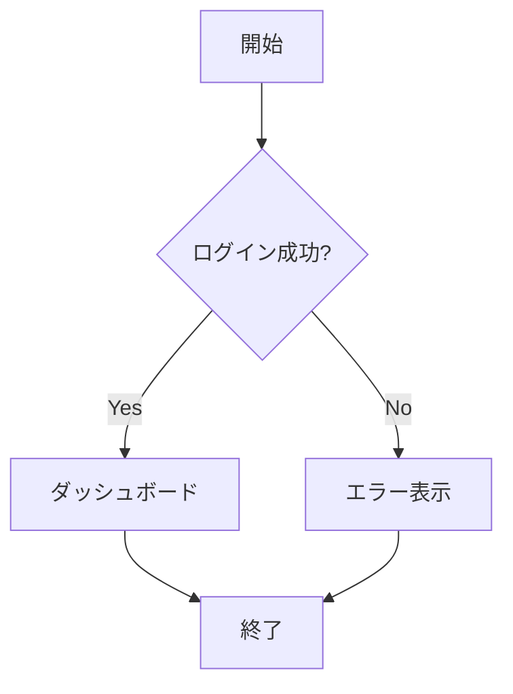

---

## ループ

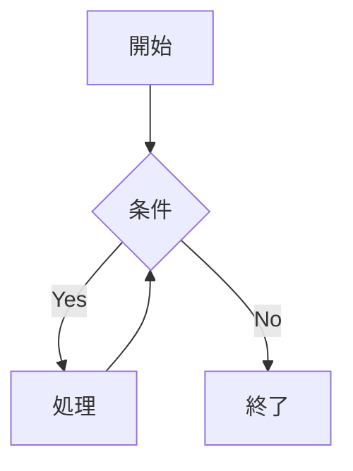

---

## ノードIDと表示名

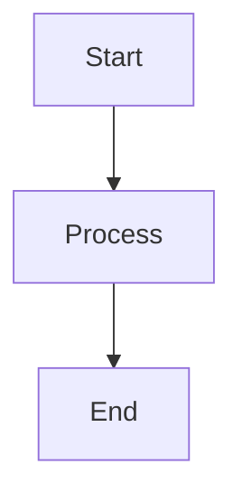

- `A B C` は内部ID
- `[Start]` は表示名

---

## 矢印

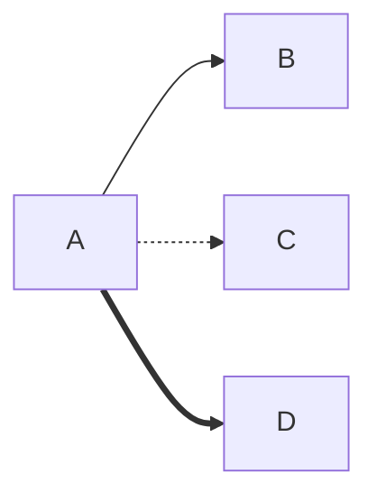

| 記号   | 意味 |
| ------ | ---- |
| `-->`  | 通常 |
| `-.->` | 点線 |
| `==>`  | 強調 |

---

## 矢印ラベル

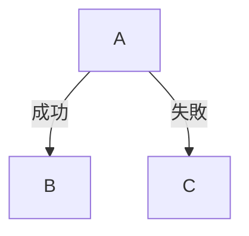

---

## サブグラフ

業務フロー整理に便利。

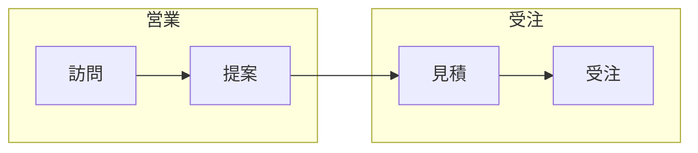

---

## シーケンス図

APIや処理フロー説明に便利。

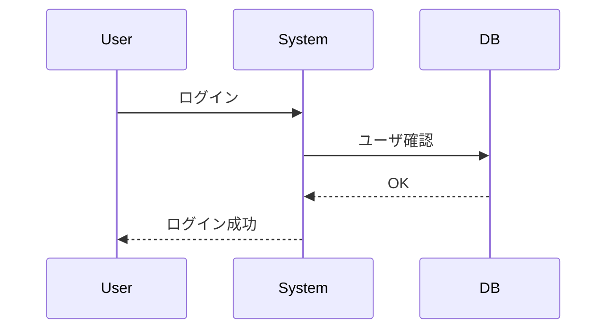

| 記号   | 意味       |
| ------ | ---------- |
| `->>`  | 同期       |
| `-->>` | レスポンス |

---

## クラス図

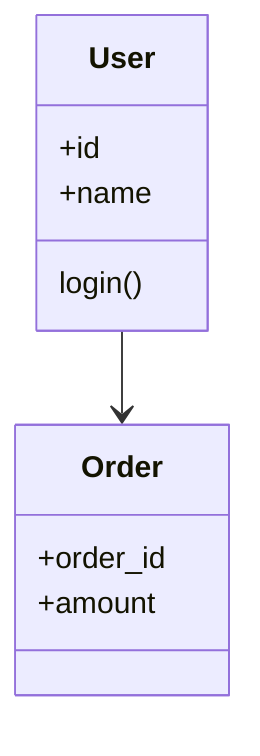

---

## 状態遷移図

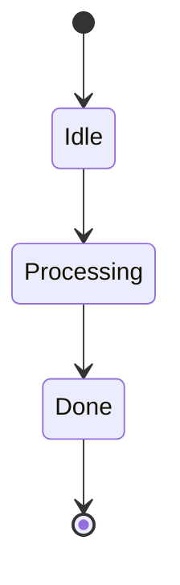

---

## ガントチャート

プロジェクト管理

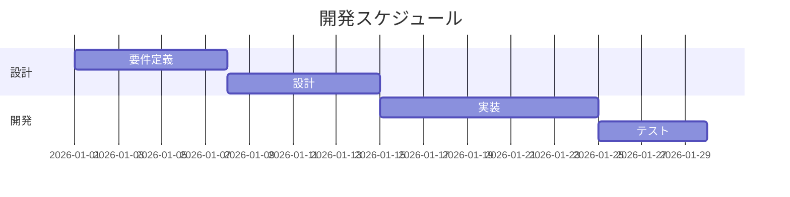

---

## 円グラフ

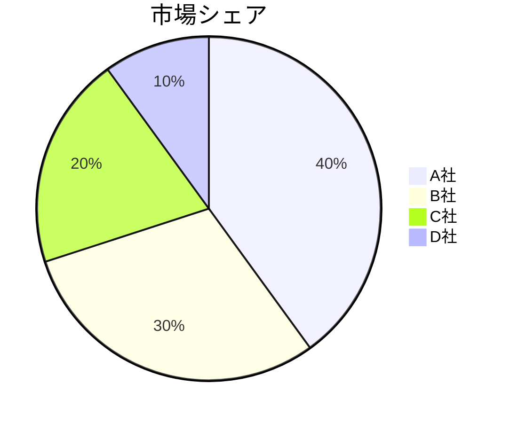

---

## スタイル設定

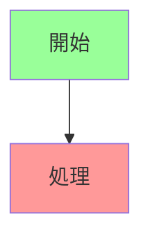

---

## 実務でよくある業務フロー例

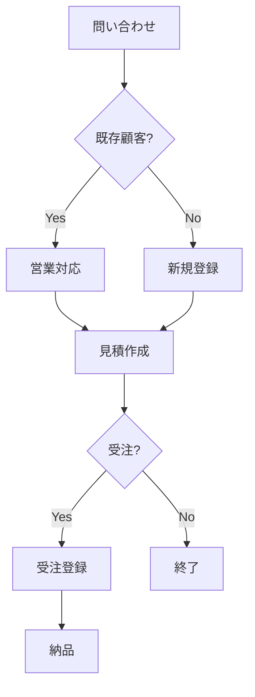